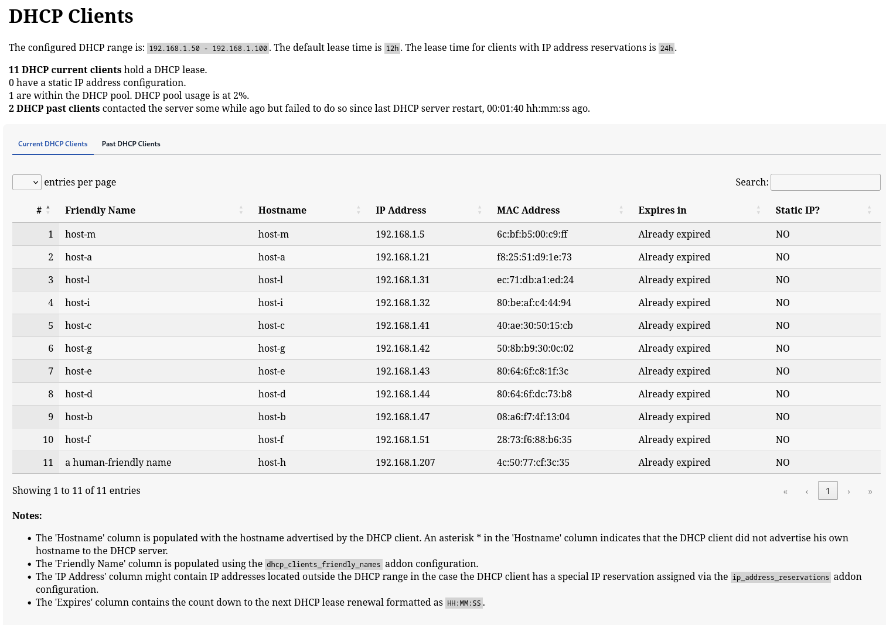
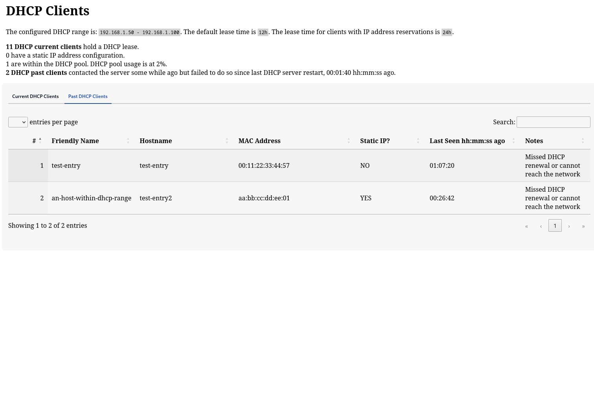

# Home Assistant Add-on: Dnsmasq as DNS and DHCP server

This addon provides 
* a DHCP server
* a DNS server (optional)
that are meant to be used in your HomeAssistant Local Area Network (LAN), to make HomeAssistant the central point of 
the network configuration: IP address allocations, FQDN resolutions, etc.

The DNS/DHCP server is based on the [dnsmasq](https://thekelleys.org.uk/dnsmasq/doc.html) utility. 
This is in contrast to several similar solutions that employ instead the [ISC dhcpd](https://www.isc.org/dhcp/) utility.
Dnsmasq is on many aspects more feature-complete than the ISC DHCP server. Moreover ISC DHCP is discontinued since 2022.

This addon also implements a UI webpage to view the list of DHCP clients with all relevant information that can be obtained through DHCP.

![Supports aarch64 Architecture][aarch64-shield] ![Supports amd64 Architecture][amd64-shield] ![Supports armv7 Architecture][armv7-shield] ![Supports i386 Architecture][i386-shield]

## About

This addon setups and manages a Dnsmasq instance configured to run both as a DNS and DHCP server (despite the name 'dnsmasq' also provides DHCP server functionalities, not only DNS).

[aarch64-shield]: https://img.shields.io/badge/aarch64-yes-green.svg
[amd64-shield]: https://img.shields.io/badge/amd64-yes-green.svg
[armv7-shield]: https://img.shields.io/badge/armv7-yes-green.svg
[i386-shield]: https://img.shields.io/badge/i386-yes-green.svg

## Features

* **Web-based UI** integrated in Home Assistant to view the list of all DHCP clients; the web UI is responsive and has nice rendering also from mobile phones.
* **UI Instant update**: no need to refresh the UI, whenever a new DHCP client connects to or leaves the network
  the UI gets instantly updated.
* **IP address reservation** using the MAC address: you can associate a specific IP address (even outside
  the DHCP address pool) to particular hosts.
* **Friendly name configuration**: you can provide your own friendly-name to any host (using its MAC address
  as identifier); this is particularly useful to identify the DHCP clients that provide unhelpful hostnames
  in their DHCP requests.
* **NTP and DNS server options**: you can advertise in DHCP OFFER packets whatever NTP and DNS server you want.
* **Past DHCP clients**: the addon keeps track of _any_ DHCP client ever connected to your network, and allows you to check if some important device in your network was connected in the past but somehow has failed to renew its DHCP lease (e.g. it is shut down).
* **DNS local cache**: speed up DNS in your network by using this addon as your home DNS server: dnsmasq will cache DNS resolutions from upstream servers to dramatically lower DNS resolution latency; in addition dnsmasq will be able to resolve any of your home device to your LAN IP address.

## Web UI

These are screenshots from the addon UI v2.0.0.

DHCP basic summary:

DHCP current clients, with DHCP lease expiration time indicator, custom link using local DNS resolver (for the `lan` domain):

DNS basic stats:

The two screenshots show the Current and the Past DHCP clients tabs.
The tables of DHCP clients are updated in real-time (no manual refresh needed) and can be sorted on any column.
Plus they're responsive and thus adapt nicely to small screens (cellphones).

Last the Web UI supports both light and dark modes.

## How to Install and How to Configure

Check out the [addon docs](DOCS.md). Open an [issue](https://github.com/f18m/ha-addon-dnsmasq-dhcp-server/issues) if you hit any problem.

## Similar Addons

* [dnsmasq](https://github.com/home-assistant/addons/tree/master/dnsmasq): a simple DNS server addon (no DHCP).
* [AdGuard Home](https://github.com/hassio-addons/addon-adguard-home): network-wide ads & trackers blocking DNS server. It also includes an embedded DHCP server.

Please note that you can use this addon in tandem with similar addons and e.g. configure AdGuard Home to fallback to the DNS server provided by this addon only for hosts having the `lan` top-level domain.

## Other Noteworthy Projects

* [pihole](https://pi-hole.net/): pi-hole embeds a modified dnsmasq variant (they named it FTL, Faster Than Light) which provides a bunch of DNS metrics that are missing from the regular dnsmasq binary.

## Future Developments

* need to write more docs about the addon configuration settings
* would be nice to provide some indication about the DNS cache metrics, see e.g. the explanations at https://docs.pi-hole.net/ftldns/dns-cache/ 
* would be nice to provide an HomeAssistant sensor about DHCP clients transitioning from "current" to "past"

## Development

See [Home Assistant addon guide](https://developers.home-assistant.io/docs/add-ons)

This addon is based on other 2 addons maintained by Home Assistant team:
* https://github.com/home-assistant/addons/tree/master/dnsmasq
* https://github.com/home-assistant/addons/tree/master/dhcp_server

The UI nginx reverse-proxy configuration has been adapted from:
* https://github.com/alexbelgium/hassio-addons/tree/master/photoprism/

For the init system used by HA addons, see:
* https://github.com/just-containers/s6-overlay
